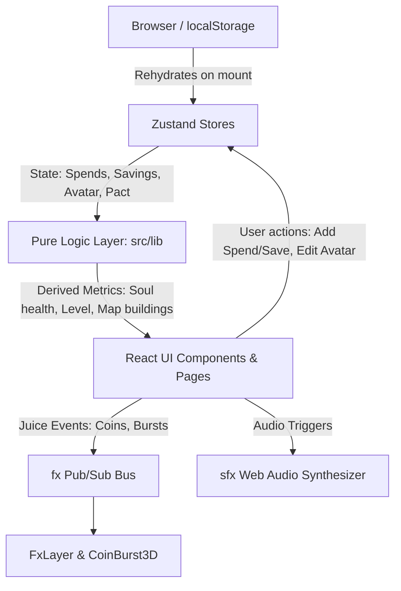

# Selora — Comprehensive Codebase Context & Architecture Guide

## 1. Executive Summary

**Selora** is a gamified personal finance and savings Single Page Application (SPA) designed with a retro 16-bit RPG pixel-art aesthetic. It transforms traditional personal budgeting into an engaging role-playing experience:
- The user's financial habits directly influence the health and mood of their **"Soul"** companion.
- Savings increase the player's **Level** and sustain a **Streak**.
- Expenditures transform the landscape into an **Isometric Overworld Map** where spending categories grow into buildings and towers.
- Users commit to a weekly **Savings Pact**, battle impulse spending, unlock tips from a rule-based **Advisor**, and customize a modular pixel-art **Avatar**.
- The application is **100% client-side** with zero server or database dependencies; all state is persisted locally in the browser via `localStorage`.

---

## 2. Architecture & Design Principles



### Key Architectural Tenets:
1. **Client-Only Zero-Backend**: No remote database, no authentication, no external API latency. State is stored in browser `localStorage` using Zustand's `persist` middleware (`selora-storage` and `selora-ui`).
2. **Strict Separation of Concerns**:
   - `src/store/`: Stores hold only raw data and simple mutators.
   - `src/lib/`: All business rules, formulas, mathematical models, and rule engines are pure, deterministic functions.
   - `src/components/` & `src/pages/`: Purely presentational and interactive UI consumers.
3. **Resilient Rendering with Progressive Fallbacks**:
   - 3D Isometric Overworld uses Three.js / React Three Fiber (`Overworld3D.tsx`) with automatic WebGL detection and seamless fallback to an interactive SVG 2D map (`OverworldMap.tsx` / `IsometricCityFallback.tsx`).
   - Avatar system uses procedural 32×32 SVG rect matrices as placeholders so the avatar customizer works out of the box with zero image assets, while allowing PNGs in `/public/avatar/` to drop in transparently.
4. **Procedural Juice & Audio**:
   - Sound effects are synthesized on-the-fly via the Web Audio API oscillators (zero `.mp3`/`.wav` asset bloat).
   - Dynamic particle coin physics render in 3D (or 2D CSS) via a decoupled typed pub/sub bus (`fx.ts`).
5. **Authentic 16-bit Retro Aesthetics**:
   - Custom Tailwind 4 theme (**Vault Aurora / Overworld** palette).
   - Typography: Google Fonts `Press Start 2P` (headers/HUD) and `VT323` (body/forms).
   - Global enforcement of `border-radius: 0 !important`, `image-rendering: pixelated`, and optional CRT scanline overlay.

---

## 3. Technology Stack

| Layer | Technology | Version | Purpose |
|---|---|---|---|
| **Runtime / UI** | React | 19.2.x | UI component tree |
| **Language** | TypeScript | ~6.0.x | Static typing and interfaces |
| **Build & Dev** | Vite | 8.2.x | Fast dev server, HMR, production bundling |
| **Styling** | Tailwind CSS | 4.3.x | Utility classes & CSS variable themes |
| **Routing** | React Router DOM | 7.18.x | Client-side routing (`BrowserRouter`) |
| **State Management** | Zustand | 5.0.x | Global stores with `persist` middleware |
| **3D Rendering** | Three.js + R3F + Drei | 0.185.x / 9.7.x / 10.7.x | Isometric overworld and 3D coin physics |
| **Charts** | Recharts | 3.10.x | Categorical spending breakdown bar charts |
| **Animation** | Framer Motion | 13.2.x | UI animations, tab transitions, modal entrances |
| **Audio** | Web Audio API | Native Browser | Procedural sound generation |
| **Linter** | Oxlint | 1.79.x | Ultra-fast JS/TS/React linting |

---

## 4. Directory & File Structure

```
Selora/
├── public/
│   ├── avatar/                     # (Optional) PNG layers for avatar parts
│   ├── sprites/                    # (Optional) Mood sprite PNGs
│   ├── favicon.svg
│   └── hero.png
├── src/
│   ├── App.tsx                     # Top-level router and layout shell
│   ├── main.tsx                    # React DOM root mounting
│   ├── index.css                   # Tailwind theme, retro styling, scanlines, fonts
│   │
│   ├── types/
│   │   └── index.ts                # Shared TypeScript models (Spend, Saving, SoulState, etc.)
│   │
│   ├── store/
│   │   ├── useStore.ts             # Primary game store (spends, savings, pact, avatar, seed)
│   │   └── useUiStore.ts           # UI preferences (CRT scanlines toggle, audio mute toggle)
│   │
│   ├── lib/                        # Pure domain logic & math engines
│   │   ├── advisor.ts              # Rule-based spending tips generator
│   │   ├── avatar.ts               # Avatar layer catalog, 32x32 SVG rect generator, palette
│   │   ├── dates.ts                # ISO date formatting, week/month range computations
│   │   ├── fx.ts                   # Typed pub/sub bus for screen coin bursts & floating text
│   │   ├── leaderboard.ts          # Simulated leaderboard rankings + user placement
│   │   ├── level.ts                # Player level calculation: floor(sqrt(savings / 500)) + 1
│   │   ├── map.ts                  # Map building metrics (height, color, mood calculation)
│   │   ├── map3d.ts                # 3D coordinate mapping for overworld tiles
│   │   ├── overworldLayout.ts      # Spatial arrangement for islands and landmarks
│   │   ├── pact.ts                 # Weekly savings pact verification, progress, redemption
│   │   ├── seed.ts                 # Realistic demo data for first-time onboarding
│   │   ├── sfx.ts                  # Web Audio synthesizer (blip, select, coin, levelUp, error)
│   │   ├── soul.ts                 # Soul health (0-100), mood derivation, and aura color
│   │   ├── stats.ts                # Net flow, impulse ratio, sum, INR currency formatter
│   │   ├── streak.ts               # Daily consecutive savings streak & consistency rate
│   │   ├── toon.ts                 # Custom shaders / toon materials for 3D meshes
│   │   ├── useReducedMotion.ts     # Accessibility hook for prefers-reduced-motion
│   │   └── webgl.ts                # Lightweight WebGL capability detection
│   │
│   ├── components/                 # Reusable UI & presentation widgets
│   │   ├── Avatar.tsx              # Layered pixel avatar renderer (PNG + SVG fallback)
│   │   ├── BottomNav.tsx           # Fixed retro navigation bar with custom pixel icons
│   │   ├── Card.tsx                # Parchment retro panel with custom glow accents
│   │   ├── CrtOverlay.tsx          # Scanlines and vignette visual overlay
│   │   ├── PixelIcon.tsx           # Handcrafted SVG 12x12 & 16x16 pixel icons
│   │   ├── RollingNumber.tsx       # Animated slot-machine style numeric counter
│   │   ├── SoulAvatar.tsx          # Animated Soul display with aura and floating particles
│   │   ├── SoulSprite.tsx          # 16x16 pixel-matrix Soul sprite with mood animations
│   │   ├── SpendingMap.tsx         # 2D spending map visualization
│   │   ├── TopStatusBar.tsx        # Persistent HUD (Level, Streak, Savings, CRT/Mute toggles)
│   │   │
│   │   ├── IsoWorld/               # 3D & 2D Overworld Map implementation
│   │   │   ├── MapView.tsx         # View switcher (3D Canvas / 2D SVG), camera reset, drawer
│   │   │   ├── Overworld3D.tsx     # Lazy-loaded Three.js Canvas container
│   │   │   ├── OverworldMap.tsx    # Responsive SVG isometric map fallback
│   │   │   └── OverworldScene.tsx  # Three.js scene (islands, buildings, hero avatar, trees)
│   │   │
│   │   ├── Map3D/                  # Legacy/alternate 3D city scene components
│   │   │   ├── CityScene.tsx       # City block 3D renderer
│   │   │   ├── IsometricCityFallback.tsx
│   │   │   ├── MapErrorBoundary.tsx# React ErrorBoundary guarding WebGL failures
│   │   │   └── SpendingWorld3D.tsx
│   │   │
│   │   └── fx/                     # Feedback effects
│   │       ├── CoinBurst3D.tsx     # Three.js instanced ballistic coin arcs
│   │       └── FxLayer.tsx         # Viewport overlay for coin bursts & floating "+₹X" text
│   │
│   └── pages/                      # Route screens
│       ├── HomePage.tsx            # Soul status, mood factors, 4 key financial metrics
│       ├── LogPage.tsx             # Record spends & savings deposits with tags & coin burst
│       ├── MapPage.tsx             # 3D/2D Overworld spending map & location breakdown
│       ├── InsightsPage.tsx        # Recharts spending distributions by location & reason
│       ├── AdvisorPage.tsx         # Actionable financial recommendations
│       ├── PactPage.tsx            # Weekly savings target tracker & global leaderboard
│       └── CreatePage.tsx          # 8-category 32x32 character creator & randomizer
│
├── package.json                    # Scripts and dependencies
├── tsconfig.json                   # TypeScript project references
├── vite.config.ts                  # Vite + React + Tailwind plugins configuration
├── .oxlintrc.json                  # Oxlint configuration
├── TECH_STACK.md                   # Tech stack overview
└── README.md                       # Project readme
```

---

## 5. Domain Models & Core Game Formulas

### 5.1 The Soul System (`src/lib/soul.ts`)
The Soul is the player's financial tamagotchi. Its health is computed deterministically:

$$\text{Health} = \text{clamp}\Big(50 + \frac{\text{NetFlow}}{100} + (\text{Streak} \times 3) - (\text{ImpulseRatio} \times 40),\, 0,\, 100\Big)$$

- **Health > 75**: `thriving` (Emerald Green `#3ddc97`, cheerful idle bob)
- **Health 51–75**: `content` (Soul Violet `#9b5de5`, calm breathing)
- **Health 26–50**: `worried` (Warning Gold `#f5c518`, anxious pulse)
- **Health 0–25**: `distressed` (Danger Red `#ff6b6b`, rapid glitch/shake)

**Factors**: The Soul highlights the top 3 weighted reasons for its current state (e.g., strong streak, high impulse expenditure, negative weekly net flow).

### 5.2 Financial Health Metrics (`src/lib/stats.ts` & `src/lib/streak.ts`)
- **Net Flow**: $\sum \text{Savings} - \sum \text{Spends}$ within a given timeframe (week/month).
- **Impulse Ratio**: $\frac{\sum \text{Spends where reason = 'Impulse'}}{\sum \text{All Spends}}$.
- **Deposit Consistency**: Percentage of the last 7 calendar days that contain at least one savings deposit.
- **Savings Streak**: Number of consecutive active days with deposits, starting from today (or yesterday if today's deposit hasn't occurred yet).

### 5.3 RPG Progression & Leveling (`src/lib/level.ts`)
- **Player Level**: Derived purely from cumulative lifetime savings:
  $$\text{Level} = \left\lfloor \sqrt{\frac{\text{TotalSavings}}{500}} \right\rfloor + 1$$
- **Level Progress**: Quadratic curve ensuring higher levels require exponentially greater savings.

### 5.4 Weekly Pact & Quests (`src/lib/pact.ts`)
- Default target: ₹2,000 per week starting each Monday.
- Progress updates automatically on each logged saving.
- Reaching 100% awards a `🏅 Badge Earned!`.
- If the week ends before the target is reached, the pact fails and generates a **Gentle Redemption Quest** (save 50% of the target in 3 days to rehabilitate the Soul).

### 5.5 Isometric Overworld Building Engine (`src/lib/map.ts`)
Each location where money was spent generates a building on the map:
- **Height**: $\text{Base}(30\text{px}) + \left(\frac{\text{Spend}}{500}\right) \times 50\text{px}$ (capped at 200px).
- **Mood**:
  - $\frac{\text{Spend}}{\text{TotalSavings}} < 0.3 \implies$ **Tidy** (Green, well-managed cottage)
  - $\frac{\text{Spend}}{\text{TotalSavings}} < 0.8 \implies$ **Moderate** (Yellow, busy townhome)
  - $\ge 0.8 \implies$ **Ominous** (Red, towering storm fortress)

---

## 6. Avatar System (`src/lib/avatar.ts` & `src/components/Avatar.tsx`)

The avatar is composed of 8 modular layers on a fixed **32×32 pixel grid**:
1. `body` (shapes: classic, slim, broad)
2. `skin` (colors: light `#ffd9b3`, tan `#e8b07a`, brown `#a5673f`, dark `#603920`, orc `#78a060`, alien `#80c0d8`)
3. `hair` (styles: short, messy, curly, spiky, bob, long, buzz, bald)
4. `hairColor` (colors: black, brown, blonde, red, blue, purple, green, silver)
5. `eyes` (styles: normal, wide, wink, calm, shades, glasses)
6. `outfit` (clothing: tunic, armor, hoodie, robe, suit, overalls)
7. `hat` (headwear: none, cap, wizard, crown, bandana, helmet)
8. `accessory` (items: none, sword, staff, shield, coin, backpack)

**Progressive Art Architecture**:
- Each layer resolves to `/avatar/<folder>/<id>.png`.
- An image preloader tests if the PNG file exists.
- If missing, the `<Avatar />` component automatically renders SVG `<rect>` elements mapped from `src/lib/avatar.ts`.
- Drop-in asset pipeline: Placing a PNG in `public/avatar/<folder>/<id>.png` instantly overrides the placeholder without any code modification.

---

## 7. Global State & Persistence (`src/store/`)

### `useStore.ts` (`selora-storage`)
- `spends`: Array of `Spend { id, amount, location, reason, date, timestamp }`
- `savings`: Array of `Saving { id, amount, note, date, timestamp }`
- `customLocations` & `customReasons`: User-created tags
- `recentLocations` & `recentReasons`: Last 5 used tags for one-tap auto-complete
- `pact`: `WeeklyPact` object
- `avatar`: Current `AvatarConfig`
- `userName`: Display name (default: "You")
- `seeded`: Boolean flag tracking initial demo seed data load
- **Hydration & Seeding**: `onRehydrateStorage` checks if localStorage is empty; if so, it seeds realistic sample data (`createSeedSpends()`, `createSeedSavings()`) and verifies pact status.

### `useUiStore.ts` (`selora-ui`)
- `crtEnabled`: Boolean (toggles retro scanlines and chromatic vignette)
- `muted`: Boolean (controls synthesized Web Audio output)

---

## 8. Routing & Screen Map

| Route | Page Component | Key Functionality |
|---|---|---|
| `/` | `HomePage.tsx` | Main dashboard: Soul Avatar, health factor list, 4 summary stat cards (Streak, Net Flow, Consistency, Impulse Ratio). |
| `/log` | `LogPage.tsx` | Quick dual-mode logger (Spend vs Save), recent tag pills, inline tag creator, form validation, triggers coin arc juice and sound effects. |
| `/map` | `MapPage.tsx` | Interactive 3D/2D Overworld Map. Displays spending islands, custom building models, clickable tooltips with financial tips, and 2D/3D toggle. |
| `/insights` | `InsightsPage.tsx` | Analytics with Recharts bar charts. Toggleable by Week or Month; ranks expenses by location and reason. |
| `/advisor` | `AdvisorPage.tsx` | Rule-based financial guidance: flags top spending locations, primary spend drains, weekday spend spikes, and impulse ratios. |
| `/pact` | `PactPage.tsx` | Weekly savings commitment meter, target adjustment modal, failure redemption quest, and simulated leaderboard. |
| `/create` | `CreatePage.tsx` | Interactive 8-category pixel avatar creator with live preview, randomizer, and color swatches. |

---

## 9. Developer Guidelines & Workflows

### Common Commands
```bash
npm run dev        # Launch Vite development server with HMR (typically http://localhost:5173)
npm run build      # TypeScript type check (tsc -b) followed by production Vite build
npm run preview    # Preview the production build locally
npm run lint       # Run Oxlint for high-speed static code analysis
```

### Conventions & Code Patterns
- **Pure Logic First**: When adding financial rules, level curves, or calculations, place them in `src/lib/<name>.ts` as pure functions and export them. Do not place business calculations directly inside React components or stores.
- **Pixel Styling**: Always respect the retro aesthetic:
  - Do not use rounded borders (`border-radius: 0`).
  - Use `font-pixel` (`Press Start 2P`) for labels, buttons, and titles.
  - Use `font-body` (`VT323`) for long text, inputs, and descriptions.
  - Use retro shadow styles (`shadow-[0_0_0_2px_#3a2410]`).
- **Sound Effects**: Play sounds on user interaction via `sfx.blip()`, `sfx.select()`, `sfx.coin()`, `sfx.levelUp()`, or `sfx.error()`. Never load external audio assets; update oscillator configurations in `src/lib/sfx.ts`.
- **Feedback & Juice**: Use `fx.emit('coins', { kind, amount, anchor })` or `fx.emit('soulBurst', { anchor })` to launch ballistic coins and floating pixel values.
